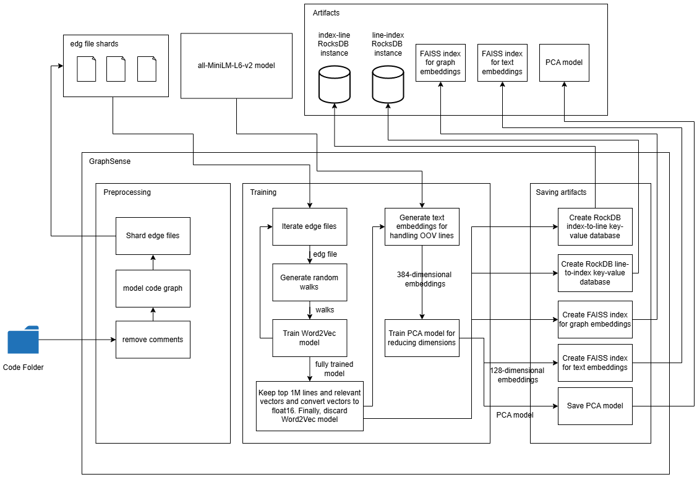
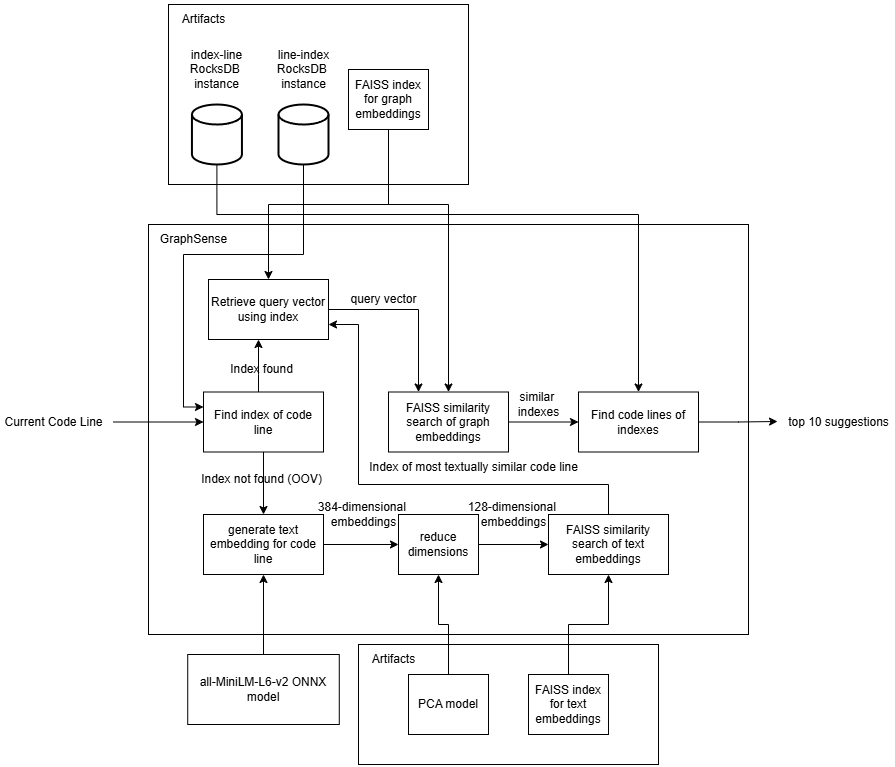
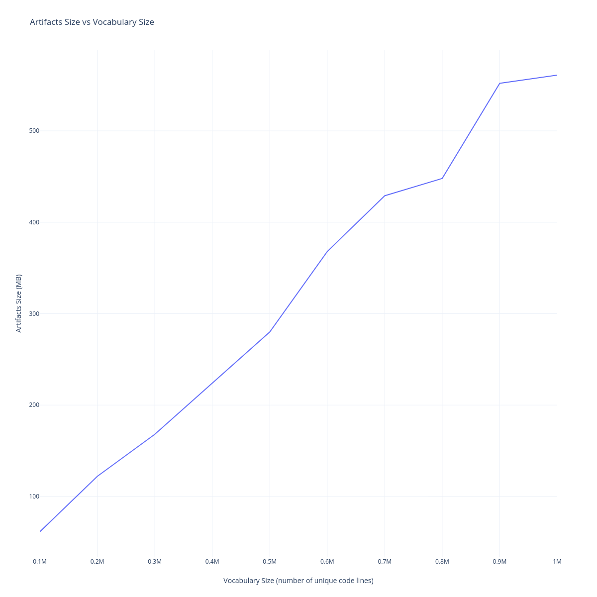

<p align="center">
  
</p>

<p align="center">
    <a href="./LICENSE"></a>
    <a href="https://github.com/NavodPeiris/graphsense/releases"></a>
    <a href="support os"></a>
    <a href=""></a>
    <a href="https://github.com/NavodPeiris/graphsense/issues"></a>
    <a href="https://github.com/NavodPeiris/graphsense/stargazers"></a>
    <a href="https://pypi.org/project/graphsense/"></a>
    
</p>

## GraphSense
GraphSense is a framework that can be used to easily train and use code suggestion models with minimal data preprocessing and resource consumption. No transformers are used and underlying algorithm used was Node2Vec. FAISS used as the vector index and RocksDB used to store code line to index and index to code line mappings.

GraphSense is highly optimized for performance and efficiency.

### Requirements

* Python 3.8 or greater


### installation:
```
pip install graphsense
```


### Training example:

```
from graphsense import GraphTrain

g = GraphTrain()
# train the model
g.line_completion(directory_path="code_files", language="Python")
```

### Inference example:

```
from graphsense import GraphInfer

g = GraphInfer()

g.load_artifacts()  # load the artifacts to memory
suggestions = g.infer("def factorial(n):")
g.unload_artifacts()  # clean memory

print("top 10 suggestions: ", suggestions)
```

### Architecture

#### Training Architecture

 

#### Inference Architecture

 

### Performance Comparison with gpt2_medium finetuned model
Dataset used to train models: https://github.com/TheAlgorithms/Python 

#### gpt2-medium model (Fine-tuned on Python Algorithms dataset)
```
artifacts size: 1.44 GB   
avg inference time (CPU): 8 seconds 
avg inference time (GPU): 2.2662 seconds
avg memory usage: 1800 MB 
```

#### GraphSense (trained on Python Algorithms dataset)
```  
artifacts size: 13.9 MB
avg inference time (CPU): 0.0079 seconds 
avg memory usage: 277.8194 MB 
``` 

### Performance and Scalability

#### Accuracy of GraphSense (vector size: 128)
| Dataset               | Top-1 Accuracy | Top-3 Accuracy | Top-10 Accuracy |
|-----------------------|----------------|----------------|-----------------|
| TheAlgorithms(Python) | 0.4718         | 0.8012         | 0.8958          |


#### Scalability of GraphSense (CPU) (vector size: 128)
```
vocabulary = 100,000
average memory usage: 273.777 MB
average execution time: 0.0113 seconds
artifacts size: 61.3 MB

vocabulary = 200,000
average memory usage: 325.8949 MB
average execution time: 0.0155 seconds
artifacts size: 122 MB

vocabulary = 300,000
average memory usage: 377.1085 MB
average execution time: 0.0185 seconds
artifacts size: 168 MB

vocabulary = 400,000
average memory usage: 428.3011 MB
average execution time: 0.0227 seconds
artifacts size: 224 MB

vocabulary = 500,000
average memory usage: 478.8532 MB
average execution time: 0.0273 seconds
artifacts size: 280 MB

vocabulary = 600,000
average memory usage: 531.0189 MB
average execution time: 0.0301 seconds
artifacts size: 368 MB

vocabulary = 700,000
average memory usage: 581.3494 MB
average execution time: 0.0333 seconds
artifacts size: 429 MB

vocabulary = 800,000
average memory usage: 633.226 MB
average execution time: 0.038 seconds
artifacts size: 448 MB

vocabulary = 900,000
average memory usage: 685.1932 MB
average execution time: 0.0439 seconds
artifacts size: 552 MB

vocabulary = 1,000,000
average memory usage: 734.5819 MB
average execution time: 0.0444 seconds
artifacts size: 561 MB
```

#### Linear Scaling

  
  
  